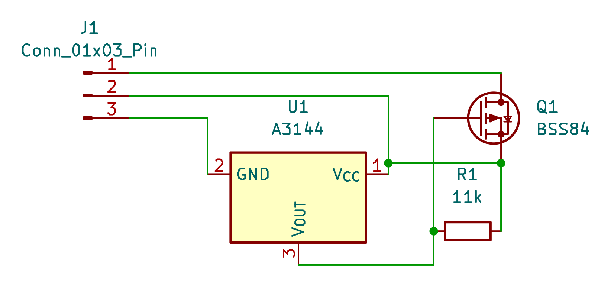

# MicroSwitch SD-E Hall Sensor Replacement

A drop-in replacement for the failed Hall effect sensors in **Honeywell/Micro Switch SD series keyboard
switches of the three-terminal "type E" variety** — the ones stamped `4A3E` on the housing.

  

<em>Left: the original sensor substrate. Right: the replacement module.</em>

## Background

Micro Switch SD series switches are Hall effect keyswitches: a magnet rides on the plunger, and a small
sensor substrate at the bottom of the switch reads its position. There are no contacts to wear out, but the
sensors themselves do die — and since they are bare substrates with the Hall element potted in resin, they
cannot be repaired, only replaced. Working donors are getting hard to find.

The **type E** variant, introduced around 1979, has only three terminals instead of four. It was designed to
cut keyboard idle current: the terminal that used to be ground became an *input*. When that input is high or
disconnected, there is no potential difference across the switch and it does nothing. When the input is pulled
low, the switch powers up and its output reflects the key state — low when inactive, high when active. In a
scanned matrix this means only the selected row draws current, cutting idle consumption by roughly 60 %.
See [telcontar.net/KBK/Micro_Switch/SD](https://telcontar.net/KBK/Micro_Switch/SD#type_E) for the full
background on the series.

This project rebuilds that behaviour from three modern parts sitting on a 3D printed base that drops into the
original sensor cavity. It is the three-terminal counterpart to the well-known
[four-terminal repair thread on Deskthority](https://deskthority.net/viewtopic.php?t=24450).

## How it works

The circuit is deliberately tiny — a Hall switch, a pull-up and a P-channel MOSFET:

| Net | Members |
|-----|---------|
| **Power (+5 V)** | A3144 `VCC` · BSS84 source · 11 kΩ |
| **Gate** | A3144 `OUT` (open collector) · 11 kΩ · BSS84 gate |
| **Output** | BSS84 drain |
| **Input** | A3144 `GND` |

* **U1 — A3144** is a standard open-collector Hall switch. Its supply sits between the *Power* and *Input*
  terminals, so the sensor is only alive while the row is selected — exactly like the original.
* **R1 — 11 kΩ** pulls the A3144's open-collector output up to *Power*.
* **Q1 — BSS84** is a P-channel MOSFET with its source on *Power* and its drain on the *Output* terminal.
  Its gate hangs on the A3144 output.

### Why the MOSFET is needed

The original type E sensor is an **open source** output: when the key is active it *drives the output high*
toward the supply, and otherwise leaves it alone. Every Hall switch you can actually buy today — the A3144
included — is the opposite, an **open drain** (open collector) output that can only *pull the output low*
toward ground. Wired straight to the keyboard, that has both the wrong polarity and the wrong direction, and
the matrix would never see a key press.

The BSS84 is what bridges the two. As a P-channel MOSFET with its source on *Power*, it is a high-side switch:
a low on its gate turns it on and connects the *Output* terminal to the supply, while a high leaves the output
floating. It inverts the A3144's sinking output back into the sourcing output the keyboard expects.

Pressing the key brings the magnet toward the sensor, the A3144 pulls its output low, the BSS84 turns on and
drives the output high. Released, the pull-up holds the gate at the source potential, the MOSFET is off and
the output is not driven. With the input terminal floating or high, nothing is powered at all and the module
is inert — the same "deselected row" behaviour the original type E sensor provides.

### Terminals

Viewed from the **component side of the keyboard**, the three terminals run **top to bottom**:

| Position | Schematic pin | Function | Connected to |
|----------|---------------|----------|--------------|
| Top | `J1-1` | **Output** | BSS84 drain |
| Middle | `J1-2` | **+5 V** | BSS84 source, A3144 VCC, 11 kΩ pull-up |
| Bottom | `J1-3` | **Input / GND** (pull low to select) | A3144 GND |

## Bill of materials

Per switch:

| Qty | Part | Package | Notes |
|-----|------|---------|-------|
| 1 | **A3144** Hall effect switch | TO-92S (flat) | Open-collector, unipolar |
| 1 | **11 kΩ** resistor | 0805 SMD | Pull-up |
| 1 | **BSS84** P-channel MOSFET | SOT-23 | |
| 1 | 3D printed base | — | `MicroSwitch 4A3E Hall sensor base.stl` |
| — | Legs | — | None needed: the third leg is the offcut from the A3144 lead trimmed in [step 2](#2-cut-the-leg) |

Also useful: fine solder, thin heat shrink tubing, double-sided tape, flush cutters, tweezers, and
isopropanol for cleaning.

## 3D printed base

Print `MicroSwitch 4A3E Hall sensor base.stl` at **0.08 mm layer height**. The base is small and the pockets
that hold the resistor and the MOSFET are shallow, so the fine layer height is not optional — coarser layers
lose the pocket geometry. No supports needed.

## Repository contents

| File | Description |
|------|-------------|
| [MicroSwitch-SD-E.kicad_sch](MicroSwitch-SD-E.kicad_sch) | Schematic (rendered as [images/schematic.png](images/schematic.png)) |
| [MicroSwitch-SD-E.kicad_pcb](MicroSwitch-SD-E.kicad_pcb) | PCB layout (work in progress) |
| [MicroSwitch 4A3E Hall sensor base.stl](MicroSwitch%204A3E%20Hall%20sensor%20base.stl) | 3D printed carrier |
| [images/](images/) | Assembly photos |

## Assembly

### 1. Preparation

Glue the MOSFET to the 3D printed base using (very) small pieces of double-sided tape. It's just for convenience when soldering and doesn't need to stick forever.

### 2. Cut the leg

Place the A3144 with the numbered side on the table and cut the lower leg (output) exactly under the spacer. Keep the cutoff leg for later.

### 3. Bend

Bend the first leg (+5V) 90 degrees to the top.

### 4. Curve

Bend more to have a small curved form (to later not touch the MOSFET).

### 5. Solder the resistor

Solder the resistor on top of legs one and three.

### 6. Connect

Bend leg two (the middle one) directly at the resistor to the top and place the whole construction on the base plate with the MOSFET. Solder one and three to the MOSFET.

### 7. Add the additional leg

Take the cutoff leg from [step 2](#2-cut-the-leg) and bend it 90 degrees around 2mm from one side. Add solder and solder it to the drain (pin 3) of the MOSFET. There can and should be plenty of solder as it will later take the energy when soldering it to the PCB from the other side.

### 8. Curve the leg

Bend the upper leg as shown in the image to be the middle leg of our sensor.

### 9. Insulate with heat shrink tubing

Use some shrink tube (around 5mm) and shrink it to the middle leg of the A3144. Then bend it as shown in the image to be the lower leg of our sensor.

### 10. Original vs. replacement

Our replacement is longer but still fits in the switch.

### 11. Insert into the switch

Carefully insert the sensor to the switch to check if everything is fine and the switch is still working. Then take it back out.

### 12. Add to the PCB

Add the new sensor to the PCB. Make sure that until here the base plate still adheres to the MOSFET to make assembly easier. Later this doesn't matter anymore as the switch sits on top and the rest is soldered.

### 13. The switch in place

Carefully place the switch on top. It should move in smoothly and if not check the orientation of the sensor again.

### 14. Cut the legs to length

Cut the legs to the normal soldering length.

### 15. Solder the holes

Solder only the holes around the legs first to not apply too much energy to our sensor construction.

### 16. Solder everything

Finalize the soldering. Do it as fast as possible to not harm our sensor solder joints.

### 17. Clean up

Clean the PCB with some isopropanol.

## References

* [Micro Switch SD series — telcontar.net (KBK)](https://telcontar.net/KBK/Micro_Switch/SD#type_E) — the
  reference documentation on the series, including the type E three-terminal variant.
* [Deskthority: Micro Switch Hall effect sensor replacement](https://deskthority.net/viewtopic.php?t=24450) —
  the four-terminal equivalent of this repair that inspired this project.
